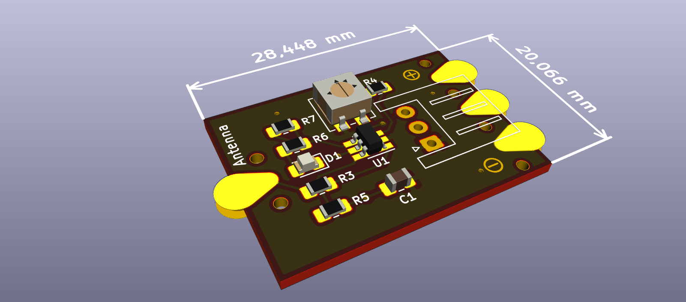

# eTprox
## eTextile Proximity Switch

### Credits
- **Wendy Van Wynsberghe** <wendy[AT]constantvzw.org>
- **License** : Cern Open Hardware (see the License file)
- **wenPage** : http://etextile-summercamp.org/swatch-exchange/sewable-proximity-switch-board-1/
- **Repository**: https://github.com/eTextile/eTprox/tree/master

### The story
"What happens when you have been working with tactile textile and touch in this era, where transmission of viral particles is a hot topic? Working with the MPR121 board? You stop and think it over. During the hard lockdown in May I started to think about tactility and proximity, activating without touching. I could not imagine a public touching the installation I was building. I researched already existing boards and possibilities and I didn’t find what I wanted. I dove into the realms of all kinds of chips and circuits. Infrared, ultrasonic, time of flight – they are all sensors that handle proximity and distance but they do not turn your conductive textile into a tactile interactive object. My second find was bingo: the MTCH101 chip, is a switch, that means it turns something on and off, it makes your conductive textile into a button by hovering over it. In the words of the company that makes them: the MTCH101 is a low cost single channel capacitive proximity detector. The distance of activation and the sensitivity depends on the voltage you give it and the surface of your conductive antenna. The activation can even happen with a non conductive layer covering it. If the switch has a temporary glitch, it recalibrates itself very fluently."

## BOM
- PCB with SMD components
- eTextile antenna (conductive thread or conductive textile)
- Microcontroller (not included)

| Référence                | Def (Kicad components names)                  | Quantity | Value   |
|:-------------------------|:----------------------------------------------|----------|:--------|
|  J2	                   | JST_XH_S3B-XH-A_1x03_P2.50mm_Horizontal	   |    1     |         |
|  RV1	                   | Potentiometer_Vishay_TS53YJ_Vertical	       |    1	  | 10K     |
|  U1	                   | SOT-23-6_Handsoldering	                       |    1	  | MTCH101 | 
|  D1	                   | LED_0805_2012Metric_Pad1.15x1.40mm_HandSolder |    1	  | LED     |
|  C1	                   | C_0805_2012Metric_Pad1.18x1.45mm_HandSolder   |    1	  | 0.1µF   |
|  R7,R3	               | R_0805_2012Metric_Pad1.20x1.40mm_HandSolder   |    2	  | 4.7K    |
|  R6	                   | R_0805_2012Metric_Pad1.20x1.40mm_HandSolder   |    1	  | 1K      |
|  R5,R4	               | R_0805_2012Metric_Pad1.20x1.40mm_HandSolder   |    2	  | 10K     |

## Credits
Design forked from Knottex project @ Timelab.

# TODO
- See : http://www.farnell.com/datasheets/1714150.pdf
